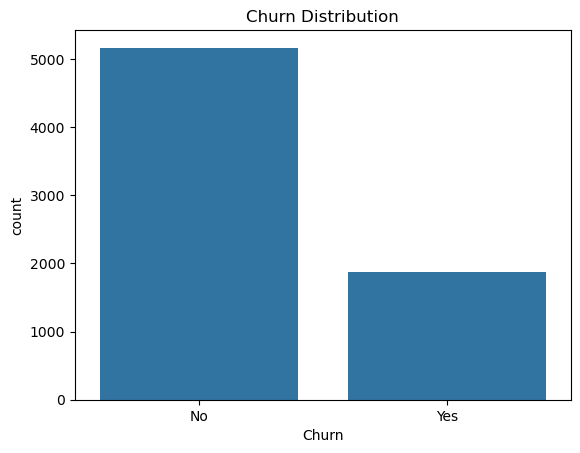
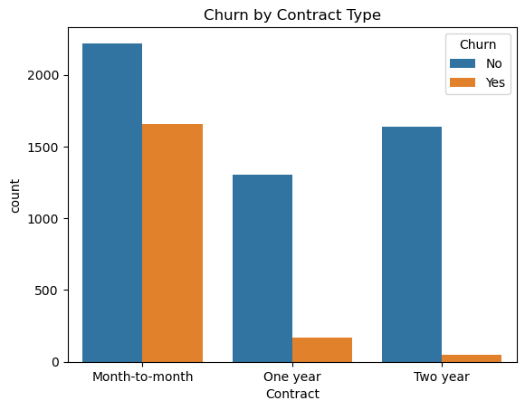
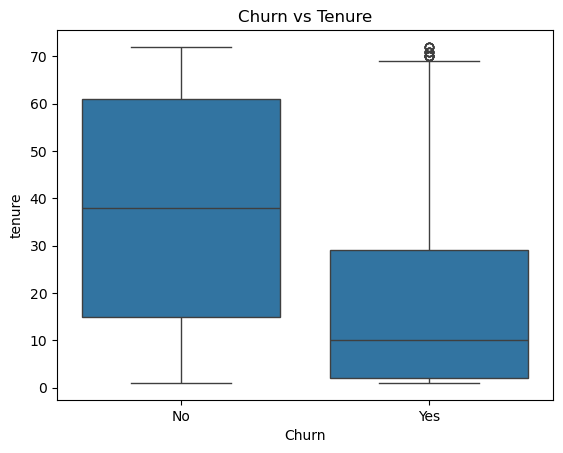
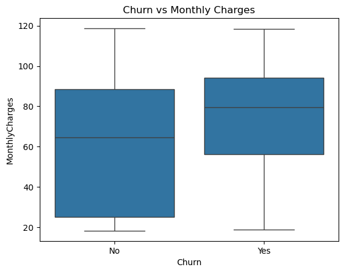
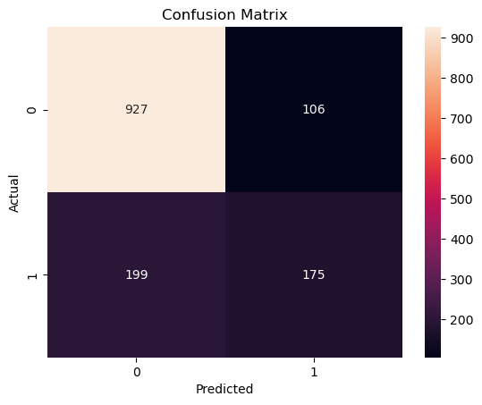
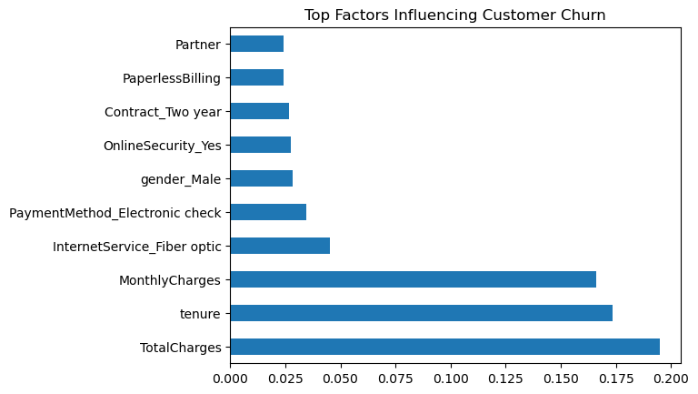

# Customer Churn Prediction

## Project Overview

Customer churn prediction is an important business problem where companies try to predict whether a customer will leave their service.

In this project, a machine learning model is built to predict customer churn using the **Telco Customer Churn dataset**. The project includes data cleaning, exploratory data analysis (EDA), feature engineering, model training, and model evaluation.

The model helps identify the key factors that influence customer churn so businesses can improve customer retention strategies.

---

## Dataset

Dataset: **Telco Customer Churn Dataset**

The dataset contains information about 7043 telecom customers and 21 features describing their demographic information, services subscribed, and billing details.

The dataset contains customer information such as:

* Gender
* Tenure (how long the customer has stayed)
* Internet service type
* Contract type
* Payment method
* Monthly charges
* Total charges
* Churn status

Target Variable:

```
Churn
```

* **1 → Customer churned**
* **0 → Customer stayed**

---

## Technologies Used

* Python
* Pandas
* NumPy
* Matplotlib
* Seaborn
* Scikit-Learn

---

## Project Workflow

The project follows a standard data science workflow:

1. Data Loading
2. Data Cleaning
3. Exploratory Data Analysis (EDA)
4. Feature Engineering
5. Train-Test Split
6. Model Training
7. Model Evaluation
8. Feature Importance Analysis

---

## Exploratory Data Analysis

### Churn Distribution



This plot shows the overall distribution of customers who stayed vs customers who churned.

---

### Churn by Contract Type



Customers with **month-to-month contracts** show a significantly higher churn rate compared to customers with long-term contracts.

---

### Churn vs Tenure



Customers with **short tenure** are more likely to churn compared to long-term customers.

---

### Churn vs Monthly Charges



Customers paying **higher monthly charges** tend to churn more frequently.

---

## Machine Learning Model

The model used in this project:

```
Random Forest Classifier
```

Why Random Forest?

* Handles complex relationships
* Works well with tabular data
* Reduces overfitting using multiple decision trees

---

## Model Evaluation

### Accuracy

The model achieved an accuracy of:

```
78%
```

---

### Confusion Matrix



The confusion matrix shows how many predictions were correct vs incorrect.

---

## Feature Importance

The most important features influencing churn prediction:

* TotalCharges
* MonthlyCharges
* Tenure
* InternetService_Fiber optic
* PaymentMethod_Electronic check
* Contract type



This visualization shows the top factors affecting customer churn.

---

## Key Business Insights

* Customers with **higher monthly charges** are more likely to churn.
* Customers with **short tenure** show higher churn probability.
* **Month-to-month contracts** have the highest churn rate.
* **Fiber optic internet users** show higher churn tendencies.
* Payment method also influences churn behavior.

---

## Author

Gautam Jha
B.Tech Computer Science Engineering
Aspiring Data Analyst / Data Scientist


